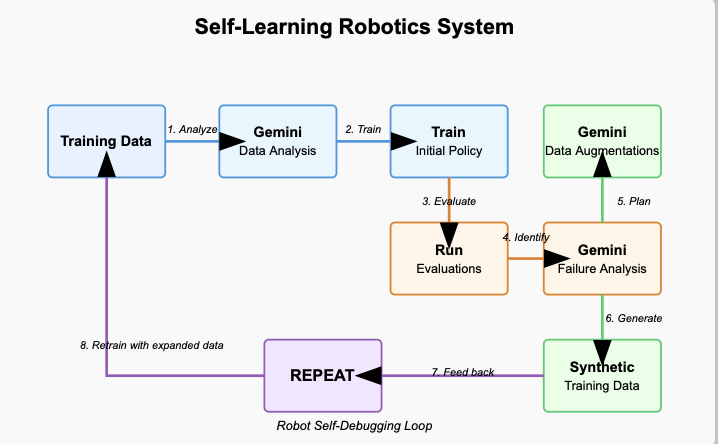

# Self-Learning Robotics Framework

> An experimental framework for robots that debug themselves through iterative data analysis and augmentation

This project implements a closed-loop system where robots can analyze their own performance, identify weaknesses, and automatically generate targeted training data to address those weaknesses. Think of it as a robot that can debug itself.

<p align="center">
  
</p>

## Key Idea

Most robotics systems plateau because they're only learning from the data we give them. This framework enables robots to:

1. **Analyze their own performance**: Assess success or failure of each attempt
2. **Identify specific weaknesses**: Determine why failures occurred (position biases, color dependencies, etc.)
3. **Generate targeted synthetic data**: Create new training examples that specifically address those weaknesses
4. **Retrain and repeat**: Train a new, improved policy and continue the cycle

## Components

### 1. Gemini Brain (Analysis Engine)

Uses Google's Gemini models as the "brain" of the system:

- **Gemini 2.0 Flash**: Analyzes visual scenes through multiple camera perspectives
- **Gemini 2.0 Pro**: Summarizes training data, evaluates failures, and recommends data augmentation strategies

### 2. Data Augmentation System

Implements various data augmentation techniques:

- **flip_frame**: Addresses positional biases by flipping images and adjusting action vectors
- **change_color**: Uses Grounded-SAM and OpenCV to change object colors (container, lego bricks)
- **inpaint_distraction**: Uses Gemini to generate new objects in empty spaces of the scene

### 3. Training Loop

Coordinates the entire process:
- Analysis of training data
- Policy training
- Evaluation
- Data augmentation recommendation
- Implementation of augmentations
- Retraining

## Getting Started

### Basic Usage

The main workflow is implemented in Jupyter notebooks in the `lerobot/caferacer` directory:

1. `01_explore_data.ipynb`: Analyzes training and evaluation data, generates augmentation recommendations
2. `augment_dataset.ipynb`: Implements the augmentations and creates new training datasets

For GPU-limited environments, use the `GPU_POOR=True` flag to optimize API calls.

## Usage Examples

### Analyzing Training Data

```python
from lerobot.caferacer.scripts.gemini_utils import analyze_training_data, summarize_training_data

# Analyze training episodes using Gemini
train_results = analyze_training_data("your/repo_id", episodes=list(range(10)), GPU_POOR=True)

# Generate a summary with recommendations
train_summary = summarize_training_data(train_results)
print(train_summary)
```

### Evaluating Performance and Getting Augmentation Recommendations

```python
from lerobot.caferacer.scripts.gemini_utils import analyze_eval_data, get_augmentations, parse_json

# Analyze evaluation episodes
eval_results = analyze_eval_data("your/eval_repo", episodes=list(range(1,10)))

# Get augmentation recommendations
augmentations_raw = get_augmentations(eval_results, train_summary)
augmentations = parse_json(augmentations_raw)

# Extract recommendations
DATA_AUG = augmentations['recommended_augmentations']
print(DATA_AUG)
```

### Implementing Data Augmentations

```python
import modal
from lerobot.common.datasets.lerobot_dataset import LeRobotDataset
from lerobot.caferacer.scripts.aug_utils import flip_frame, apply_color, get_mask

# Setup grounded-sam for segmentation
gsam = modal.Function.lookup("grounded-sam", "GroundedSam.run", environment_name='prod')

# Load datasets
dataset0 = LeRobotDataset("your/training_repo")

# Define augmentations
DATA_AUG = {
    'flip_frame': True, 
    'change_color': {
        'object': 'blue container', 
        'target_color': 'yellow'
    }
}

# Create augmented dataset
dataset = create_dataset("your/new_repo", dataset0, gsam, DATA_AUG=DATA_AUG)
dataset.push_to_hub()
```

## Module Descriptions

### `gemini_utils.py`

Contains functions for analyzing scenes, evaluating episodes, and generating augmentation recommendations using Gemini models.

Key functions:
- `analyze_scene`: Analyzes a single frame from top view
- `analyze_multi_view`: Combines analysis from multiple camera perspectives
- `get_summary`: Generates a summary from multiple analysis results
- `analyze_training_data`: Processes an entire training dataset
- `analyze_eval_data`: Processes an evaluation dataset
- `get_augmentations`: Recommends specific augmentations based on analysis

### `aug_utils.py`

Contains implementations of data augmentation techniques.

Key functions:
- `flip_frame`: Flips frame data horizontally and adjusts actions
- `get_mask`: Uses Grounded-SAM to generate object masks
- `change_object_color`: Changes the color of objects in an image
- `apply_color`: Applies color changes to tensors in a dataset

### `inpaint_utils.py`

Tools for generating and adding new objects to scenes.

Key functions:
- `get_object_mask`: Gets a mask for an object
- `get_top_empty_space`: Identifies empty regions in a top-down view
- `gemini_inpaint_image`: Uses Gemini to generate a new image with an added object
- `create_inpainted_frame`: Creates a new frame with the inpainted object

## Limitations & Future Work

This is an **experimental framework** focused on the LeRobot dataset and SO100 robot arm. Current limitations:

- Only tested with pick-and-place tasks using Lego bricks
- Requires Gemini API access
- GPU-intensive for full functionality (but has GPU_POOR options)

Future directions:
- Generating simulations on the fly from training episodes
- Automatically generating augmentation scripts
- Better integration with diverse robot platforms

## Custom Solutions

If you're interested in adapting this framework for your specific robotics data or use case, please reach out:

- Email: hey@tuul.ai
- Twitter: [@shreyasgite](https://x.com/shreyasgite)

## License

[MIT License](LICENSE)
